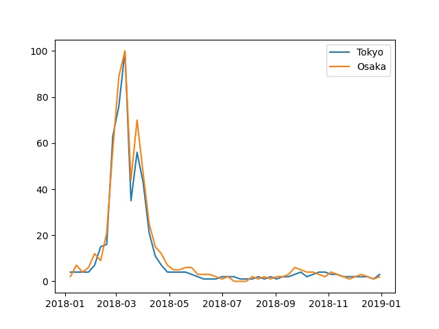

# Demo Program to Scrape Google Trend

## Theme

Obtain the pollen data of Tokyo and Osaka city in 2018 from Google Trend and convert it into Excel file.

## Graph

There is no direct data comparation between Tokyo and Osaka, just shows the variation rate during the period.

## Dependencies

- pandas
- numpy
- matlotlib

## References

Adapted from [Pytrends](https://pypi.org/project/pytrends/).
