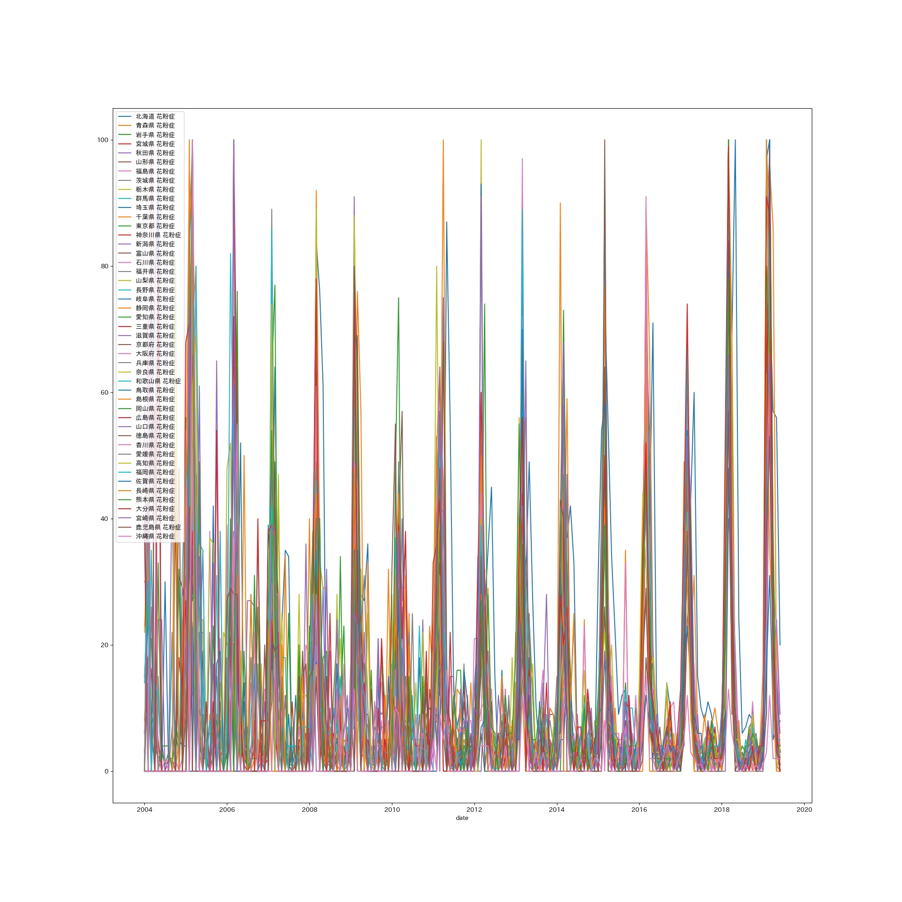

# Program to Scrape Google Trend

## Theme

Pollen search data extraction and analysis from Google Trends.
<!-- Obtain the pollen data of Tokyo and Osaka city in 2018 from Google Trend and convert it into Excel file. -->

## Graph

Rough Graph for pollen searches in Japan.
<!-- There is no direct data comparation between Tokyo and Osaka, just shows the variation rate during the period. -->

## Dependencies

- pandas
- numpy
- matlotlib
- openpyxl

## References

Adapted from [Pytrends](https://pypi.org/project/pytrends/).
