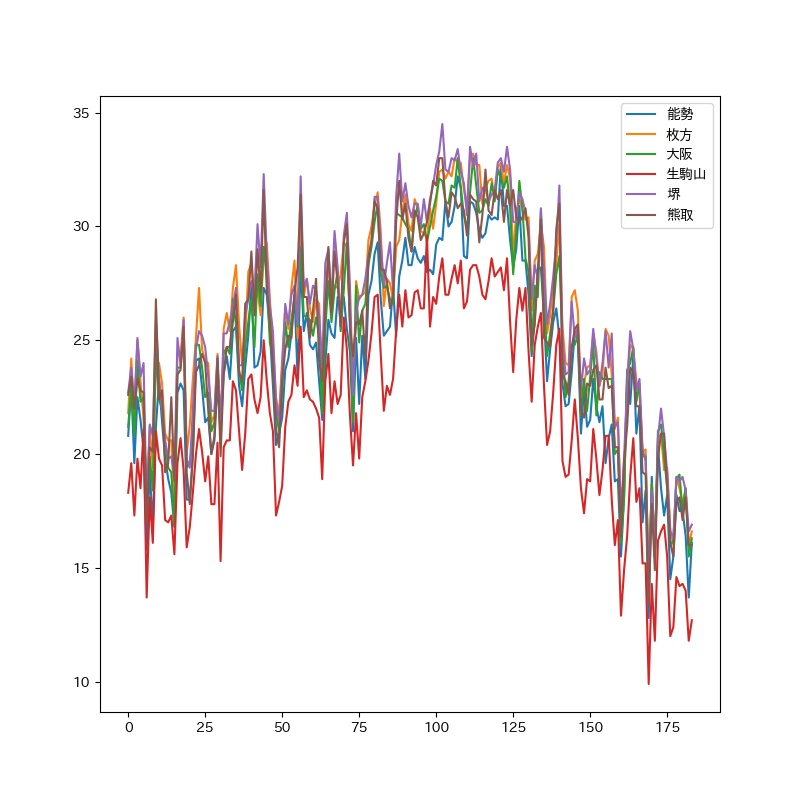

# Program to do web scraping for Research Assistant

 <!-- Scrape Google Trend and Ministry of Environment in Japan -->

## 1th theme

- Pollen search data extraction and analysis from Google Trends.
https://trends.google.com/trends/explore?q=%E8%8A%B1%E7%B2%89%E7%97%87&geo=JP
## 2nd theme

- Extract heat illness information of observatories from Ministry of Environment and Meteorological Agency in Japan.
https://www.wbgt.env.go.jp/     https://www.data.jma.go.jp/gmd/risk/obsdl/#

## 3rd theme

- Weather alert extraction from Meteorological Agency in Japan.
http://agora.ex.nii.ac.jp/cps/weather/warning/area/

## Graph

Demo graph for pollen searches in Japan.

Demo graph for heat illness prevention information in Osaka.

## Dependencies

- pandas
- numpy
- matlotlib
- openpyxl
- datetime
- request
- BeautifulSoup

## References

Adapted from [Pytrends](https://pypi.org/project/pytrends/) in GoogleTrends part.
