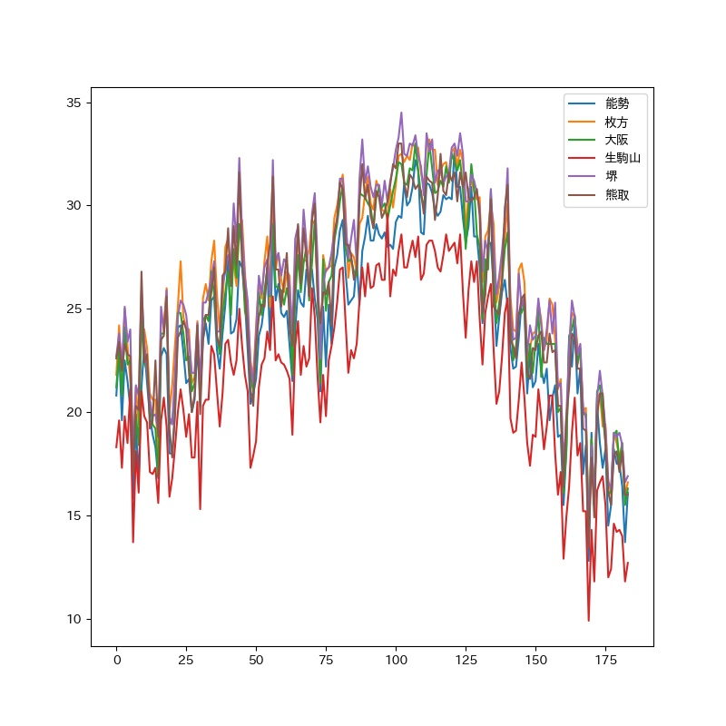

# Web scraping programs for Research Assistant

Four themes are researched so far, details are introduced in each sub-folder.

## Themes 

### Google trends

- Pollen search data extraction and analysis from Google Trends.

### Wet-bulb globe temperature (WBGT)

- Extract heat illness information of observatories from in Japan.

### Weather alerts

- Weather alerts extracted from Meteorological Agency in Japan.

### Geocoding

- Add geocode information for schools at one list.  

## Datas

Datas are mainly saved in the format of excel or csv files, which may not attached here because of sizes.

## Dependencies

Recorded in requirement.txt

## Attachments

Graphs are just for taking a look.

<!--  -->

Demo graph for pollen searches in Japan.

<!--  -->

Demo graph for heat illness prevention information in Osaka.